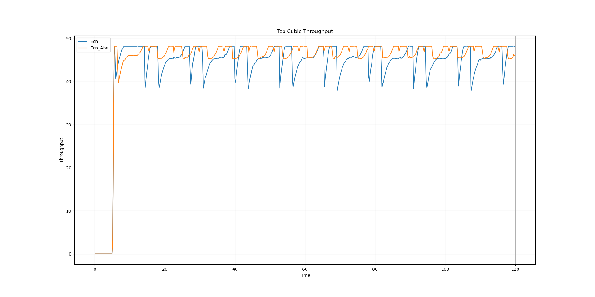
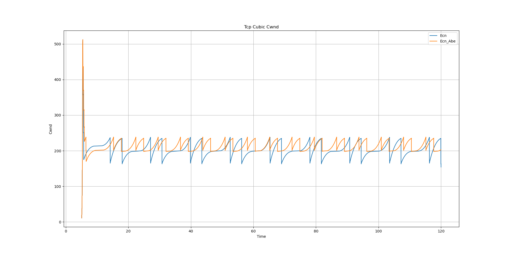

# ECN ABE Implementation in NS3

The project represents an implementation of ECN ABE (Explicit Congestion Notification with Alternative Backoff) in accordance with RFC 8511. ECN ABE stands as an enhancement to TCP congestion control, leveraging Explicit Congestion Notification (ECN) for expedited and precise congestion feedback, thereby optimizing network performance and equity. By integrating ABE mechanisms into TCP, this implementation facilitates adaptive backoff strategies, fostering more efficient and responsive congestion control. The project's objective lies in augmenting network resilience and throughput by applying ECN ABE principles to TCP-based communication protocols.

## Throughput and CWND Comparison

The images above show the comparison of throughput and CWND with ECN and ECN ABE modes.

## Resources

1. **Understanding ECN (ABE) and NS3 Documentation**
   - [RFC_8511](https://www.rfc-editor.org/rfc/pdfrfc/rfc8511.txt.pdf) - RFC for understanding ABE
   - [NS3_doc](https://www.nsnam.org/docs/manual/html/tests.html) - NS3 documentation
   - [ns3 quick start](https://www.nsnam.org/docs/tutorial/html/quick-start.html) - Guide for installing NS3

2. **Understanding TCP Implementation and ECN Implementation in NS3**
   - [ns3 github](https://github.com/nsnam/ns-3-dev-git/tree/master/src/internet/model) - Repository with code for TCP implementation
   - [ns3 doc (TCP)](https://www.nsnam.org/docs/models/html/tcp.html) - TCP documentation by NS3
   - [ECN_support_plan](https://www.nsnam.org/wiki/ECN_support_for_qdiscs_in_ns-3) - Plan to understand ECN implementation
   - [codereview ECN Phase 1](https://codereview.appspot.com/306660043/#ps40001) - Code review for ECN Phase 1
   - [codereview ECN Phase 2](https://codereview.appspot.com/314790043/#ps110001) - Continuation of ECN work

3. **Finding Possible Ways to Implement ABE**
   - [Freebsd ECN ABE patch](https://reviews.freebsd.org/rS331214) - Patch for ABE implementation in FreeBSD
   - [Freebsd ECN ABE review](https://reviews.freebsd.org/D11616) - Review on ABE implementation in FreeBSD
   - [RFC_8511](https://www.rfc-editor.org/rfc/rfc8511.html), NS3 documentation, and GitHub code [ns3 github] for TCP implementation were referenced extensively during this phase.

4. **Discussion and Selection of Implementation Method**
   - After thorough research, one method was chosen based on code simplicity, code modularity, and adherence to RFC definition.

5. **Implementation of ABE and Learning Testing in NS3**
   - [test-framework-ns3](https://www.nsnam.org/docs/manual/html/test-framework.html) - Helpful for understanding NS3 testing
   - [Contributing to ns3](https://www.nsnam.org/docs/contributing/html/index.html) - Guide for contributing to NS3

6. **Testing and Validation**
   - [tcp-validation.cc](https://github.com/nsnam/ns-3-dev-git/blob/master/examples/tcp/tcp-validation.cc) - Test code for TCP on a dumbbell topology in NS3, tracing throughput, cwnd, and RTT
   - [test-framework](https://www.nsnam.org/docs/manual/html/test-framework.html) - Test documentation by NS3
